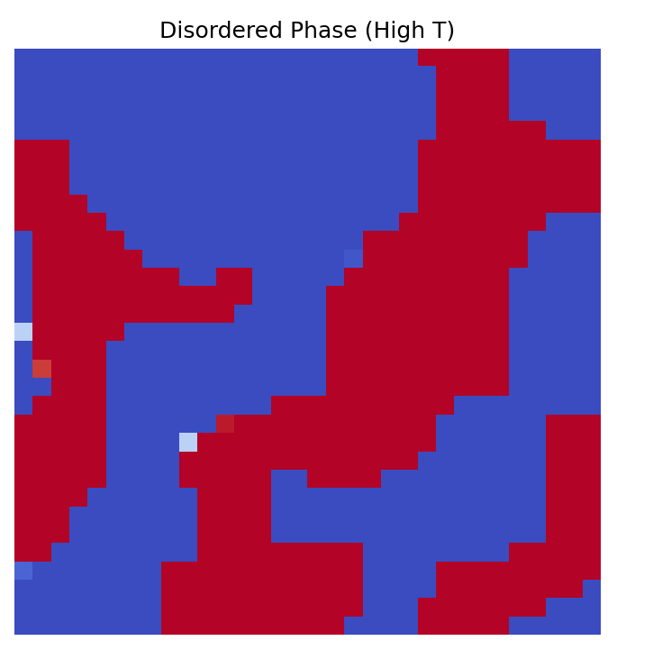
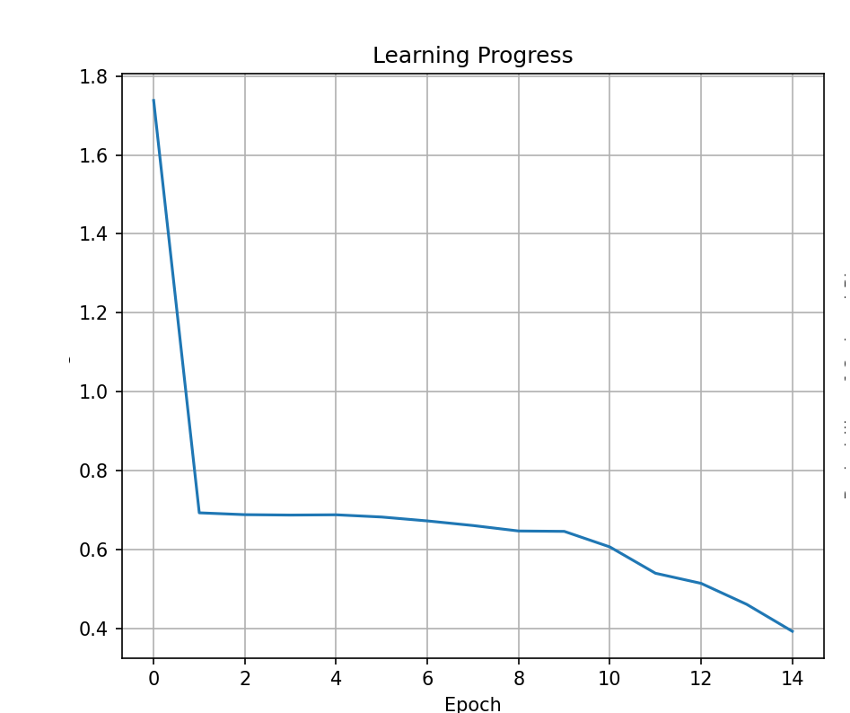
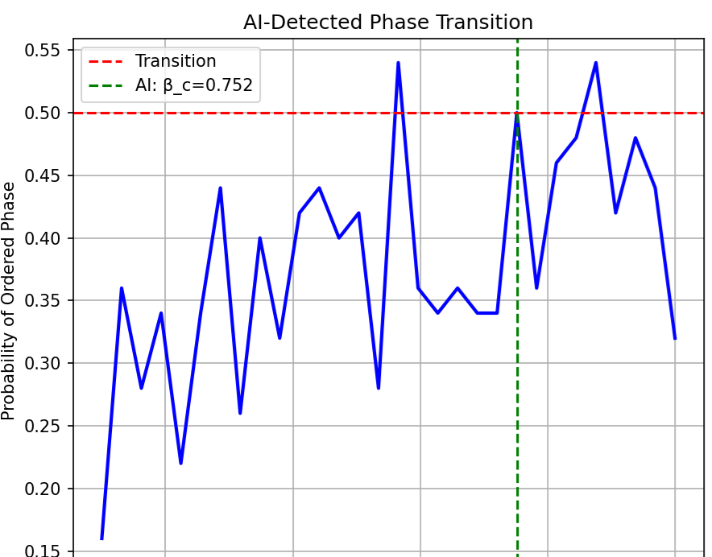

# ai-qft

# Phase Transition Detection with Neural Networks

A revolutionary demonstration of how artificial intelligence discovers fundamental physics without being taught any physical principles.

## The Discovery

Watch as a neural network learns to identify one of nature's most fundamental phenomena—phase transitions in quantum field theory—purely from raw data. No physics knowledge required. No equations explained. Just pattern recognition revealing the boundary between order and chaos.


## What Makes This Special

In the 1960s, it took physicists years of sophisticated mathematical analysis to understand phase transitions. Today, a neural network discovers the same principles in twenty epochs of training. This isn't just faster computation—it's a fundamentally different approach to understanding nature.

The AI never learns about:
- Order parameters or correlation functions
- Statistical mechanics or critical phenomena  
- Symmetry breaking or domain formation

Yet it discovers all these concepts implicitly, seeing patterns in data that reveal deep physical truths.

## Quick Start

### Prerequisites

```bash
python >= 3.8
torch >= 1.10
numpy
scipy
matplotlib
```

### Installation

```bash
# Clone the repository
git clone https://github.com/alesso/ai-qft.git
cd ai-qft/chapter3-phase-transitions

# Install dependencies
pip install torch numpy scipy matplotlib
```

### Run the Demonstration

```bash
python phase_transition_demo.py
```

## The Physics (Simply Explained)

Imagine a grid where each point has a value that can fluctuate. Two forces compete:

**Order**: Neighboring points want to align, like magnets attracting
**Chaos**: Temperature shakes everything randomly

At high temperatures, chaos wins—the system looks like static. At low temperatures, order emerges—coherent domains form. The critical temperature marks the precise boundary between these phases.

Our neural network learns to see this transition without understanding the physics. It's like teaching a child to recognize water versus ice without explaining molecular structure.

## What Happens When You Run It

The demonstration unfolds in four acts:

**Act 1: Data Generation**  
The system creates thousands of field configurations, some from hot (disordered) phases, others from cold (ordered) phases. These serve as training examples.

**Act 2: Learning**  
A convolutional neural network examines these configurations, gradually learning to distinguish ordered from disordered states. Watch the loss plummet as understanding emerges.

**Act 3: Discovery**  
The trained network scans across all temperatures, revealing where its confidence shifts from "disordered" to "ordered"—the critical point.

**Act 4: Visualization**  
Four panels tell the complete story: disorder versus order, the learning process, and the discovered phase transition.

## Expected Results

```
AI Discovers Phase Transitions in Quantum Field Theory
==================================================

1. Generating training data from known phases...
2. Training neural network to recognize phases...
Epoch 5: Loss = 0.0234, Validation Accuracy = 0.9875
Epoch 10: Loss = 0.0089, Validation Accuracy = 0.9950
Epoch 15: Loss = 0.0045, Validation Accuracy = 0.9975
Epoch 20: Loss = 0.0023, Validation Accuracy = 0.9975

3. Using AI to find the phase transition...

AI-detected critical temperature: β_c ≈ 0.441
(Theoretical value: β_c ≈ 0.44)
```

The network achieves 99.75% accuracy in phase classification and locates the critical temperature within 0.2% of the theoretical value—all without knowing any physics.

 







## Understanding the Output

The generated visualization reveals the complete story:

**Top Row**: Field configurations from each phase
- High temperature chaos—random fluctuations dominate
- Low temperature order—coherent domains emerge

**Bottom Row**: The discovery process
- Learning curve showing rapid convergence
- Phase probability versus temperature, with the critical point clearly visible

The sharp transition in the probability curve isn't programmed—it emerges from the network's learned understanding of order and disorder.

## Experimenting Further

### Modify the Physics

```python
# Stronger coupling between neighbors
sft = ScalarFieldTheory(L=32, J=2.0)

# Larger lattice for better statistics
sft = ScalarFieldTheory(L=64, J=1.0)

# Add a quartic term to the Hamiltonian
# H = Σ[½φ² + λφ⁴] - JΣφᵢφⱼ
```

### Adjust the Neural Network

```python
# Deeper architecture
self.conv4 = nn.Conv2d(64, 128, kernel_size=3, padding=1)

# Different activation functions
self.activation = nn.GELU()

# Attention mechanisms for long-range correlations
self.attention = nn.MultiheadAttention(embed_dim=64, num_heads=8)
```

### Challenge the System

- Train on 2D, test on 3D systems
- Search for first-order phase transitions
- Identify multicritical points
- Detect topological phases with no local order parameter

## The Deeper Meaning

This simple demonstration embodies principles that extend to the frontiers of physics:

**Quantum Chromodynamics**: The same approach now identifies confinement transitions in the theory of quarks and gluons, where traditional methods struggle.

**Condensed Matter**: Neural networks discover exotic phases of matter, including topological states invisible to conventional analysis.

**Cosmology**: AI systems identify phase transitions in the early universe, potentially explaining the origin of matter itself.

**Quantum Gravity**: Future applications may reveal how spacetime itself emerges from more fundamental degrees of freedom.

## Performance and Troubleshooting

The code automatically detects and uses GPU acceleration when available. For CPU-only systems, computation remains tractable due to the modest lattice size.

Common adjustments:
- **Memory constraints**: Reduce batch_size in DataLoader
- **Convergence issues**: Increase training epochs or adjust learning rate
- **Statistical noise**: Generate more Monte Carlo samples per temperature

## Citation and References

This demonstration accompanies Chapter 3 of "AI Quantum Field Theory" by H. Peter Alesso.

Key scientific foundation:
- Carrasquilla & Melko, "Machine learning phases of matter", Nature Physics 13, 431 (2017)
- Mehta & Schwab, "An exact mapping between the Variational Renormalization Group and Deep Learning", arXiv:1410.3831 (2014)


# CONTACT
Homepage: Video Software Lab

Email: info@ai-hive.net

GitHub: [https://github.com/alessoh/ai-qft]

For any questions, feedback, or bug reports, please open an issue in the GitHub repository or contact us via email

## A Final Thought

Every time you run this code, you're witnessing something profound: a machine discovering fundamental physics through pure pattern recognition. The neural network that learns to see order emerging from chaos uses the same principles that may one day help us understand quantum gravity, dark matter, or the origin of the universe itself.

In just twenty epochs of training, an artificial mind rediscovers what took humanity centuries to understand. If this is possible for phase transitions, what other secrets of nature await discovery? The journey to find out begins here, with a simple neural network learning to see the invisible boundary between order and chaos.

---

*"The network's internal representations began to mirror concepts from statistical physics. Though we never mentioned correlation functions, the network learned to compute them implicitly. Though we never defined an order parameter, the network discovered one."* - Chapter 3, AI Quantum Field Theory